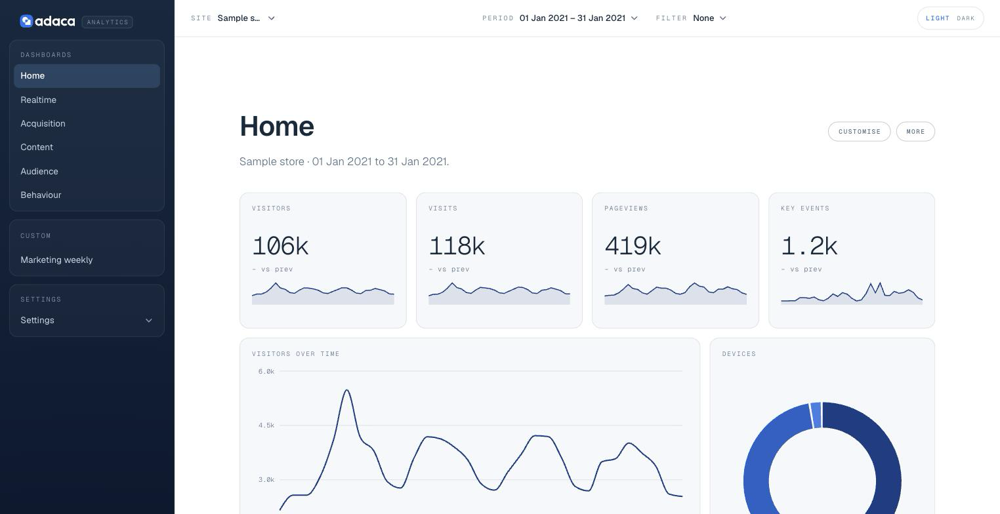

# Adaca Analytics

Self-hosted dashboards for Google Analytics 4, on Cloudflare Workers. Daily rollups
from the GA4 Data API or your BigQuery export land in a D1 database you own; realtime
stays live on Google. Dashboards are built from configurable widgets on a grid.

[](https://deploy.workers.cloudflare.com/?url=https://github.com/adacahq/adaca-analytics)



## What you get

- Six dashboards out of the box and a four-step builder for your own.
- Every number opens: sources, pages, countries and the rest are detail pages with
  their own trend and breakdowns, precomputed so they load in one round trip.
- One filter for a whole dashboard, saved segments, and read-only share links that
  can pin a filter.
- Comparison against the previous period, last year or any window; hourly detail
  for today; a live visitor count.
- Weekly and monthly summaries and traffic alerts, by email or Slack.
- Several GA4 properties as sites, BigQuery export support, light and dark, phones
  and tablets.

## Deploy

1. Create a Google service account with Viewer access on your GA4 property and
   download its JSON key. [Details](docs/operations.md#a-google-service-account)
2. Press **Deploy to Cloudflare**. It forks the repository, provisions D1 and KV,
   asks for the key, and deploys the Worker with its cron.
3. Put Cloudflare Access or the built-in Basic Auth in front of it. There is no
   sign-in. [Details](docs/operations.md#protecting-your-deployment)

Open the Worker, add your property, and the first backfill runs while you watch.

## Local development

```
npm install
cp .dev.vars.example .dev.vars   # paste the service-account JSON on one line
npm run types && npm run db:migrate
npm run dev                      # http://localhost:3000
```

`npm run build`, `npm run typecheck`, `npm run lint` and `npm test` are the four CI
gates.

## Learn more

- [Features](docs/features.md): how the numbers are made, drill-down, filters and
  segments, sharing, reports.
- [Operations](docs/operations.md): protecting a deployment, BigQuery, deploying by
  hand, limits.
- [Architecture](docs/architecture.md) and the [design system](docs/design-system.md).
- [Contributing](CONTRIBUTING.md).

## About

[Adaca](https://adaca.com) is a software consultancy. We build custom software, embed
senior engineers in client teams, and put AI to work for our clients. Adaca Analytics
is open source under the [MIT licence](LICENSE).
